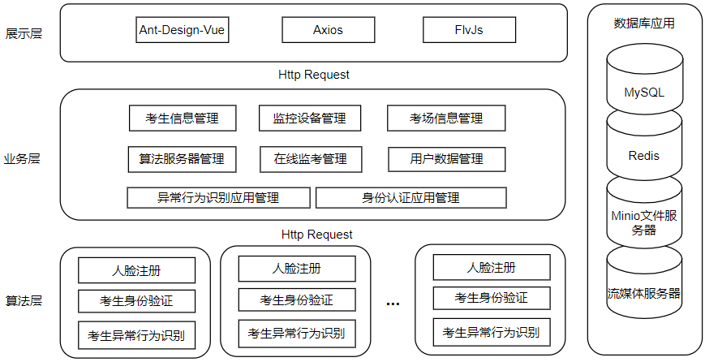
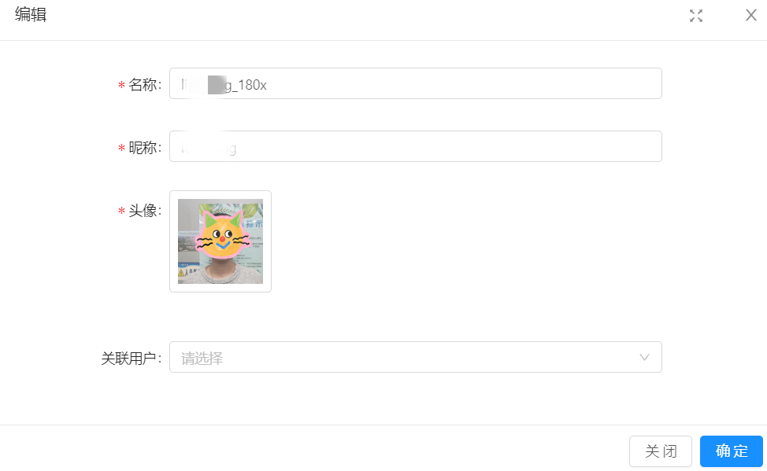
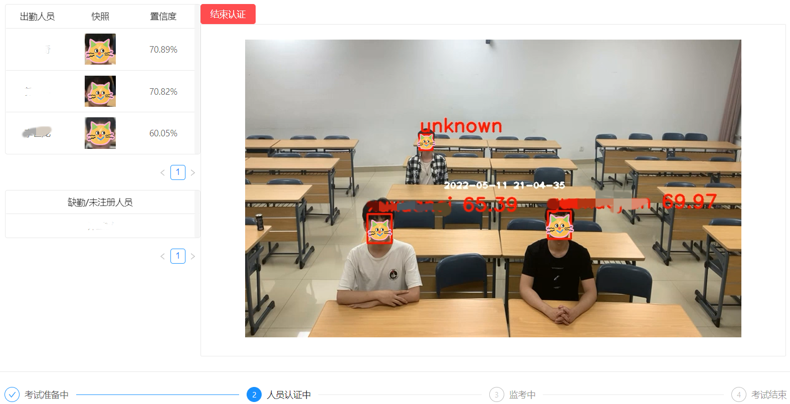
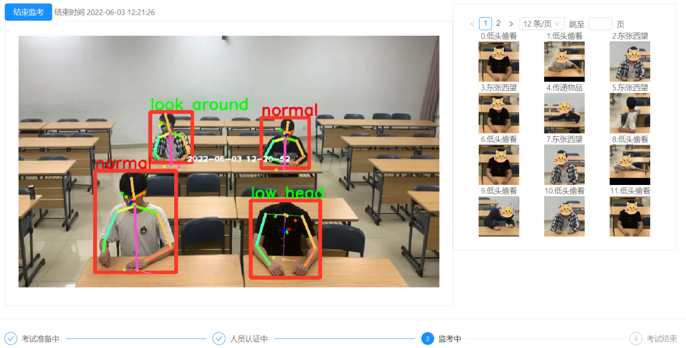
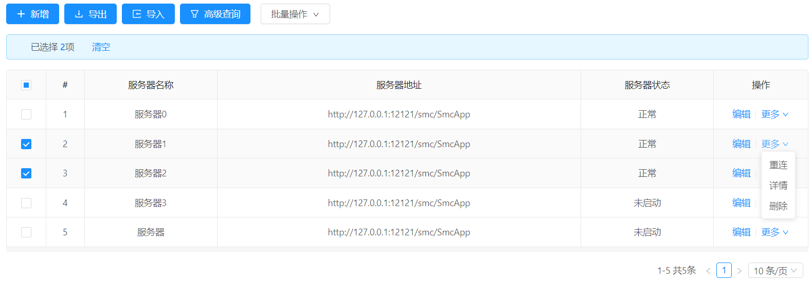

# 智慧教室在线监考系统

作弊检测、考生点名

## 架构

 

本智慧监考系统共分为4个部分，分别为：展示层、业务层、算法层和数据库。

本系统的展示层基于Vue.js框架和Ant Design Vue UI框架编写。用户通过浏览器访问前端界面来实现与系统的交互。

业务层是基于SpringBoot框架编写的Java后台服务器。该层负责本系统的大部分的数据管理和资源调度。用户通过系统的前端UI访问业务层的相关功能，进而实现对系统数据的增加、删除、修改、查看等功能。基于SpringBoot框架编写的后台服务器也能够使开发者快速地对系统的业务功能进行改进和扩展。

算法层是一组使用c++语言编写的算法应用服务器。该层部署了之前通过Pytorch框架训练得到的深度学习模型并使用TensorRT技术进行推理加速。该层使用Drogon Web应用框架实现网络访问接口，并且通过FFmepg实现对流媒体服务器的直接视频推流。

数据库应用包含了系统中所涉的数据库以及其他数据服务应用，其中，MySql负责存储系统中的大部分数据；Redis负责存储数据缓存；Minio负责存储图片等文件数据，考生异常行为检测得到的快照也将直接存储到Minio服务器上；流媒体服务器负责接收从算法应用层传来的视频流，并等待用户前端UI直接拉取视频并播放。

## 功能

### 考生人脸信息上传

上传的照片最好给脸部周围留点位置，不然检测不出来

 

### 考生点名



### 作弊检测



## 服务器管理

添加smart_classroom_algo服务器程序，服务器名字直接设置路径就好，比如`http://127.0.0.1:12121`.



# 安装和启动说明

## 数据服务(需要docker)

`docker run`后面的`-v`可以根据自己的磁盘情况选择挂载路径

### mysql

```shell
docker pull mysql

docker run -d -v /d/cache/docker/mysql/conf:/etc/mysql -v /d/cache/docker/mysql/data:/var/lib/mysql -v /d/cache/docker/mysql/mysql-files:/var/lib/mysql-files/ -p 3306:3306 --name smc_mysql -e MYSQL_ROOT_PASSWORD=hongyaohongyao mysql:latest
```

### redis

```
docker pull redis
docker run --name smc_redis -d redis
```

### minio

```shell
docker pull minio/minio
docker run -p 9000:9000 -p 9001:9001 --name smc_minio -e "MINIO_ROOT_USER=hongyaohongyao" -e "MINIO_ROOT_PASSWORD=hongyaohongyao123" -v /d/cache/docker/minio/data:/data -d minio/minio server /data --console-address ":9001"
```

### 流媒体服务器

```shell
docker pull mugennsou/nginx-http-flv
docker run -d -p 8888:80 -p 1935:1935 --name smc_video mugennsou/nginx-http-flv
```

## 前端

安装

```shell
cd ant-design-vue-jeecg
cnpm install
```

启动

``` shell
npm serve run
```

## 管理系统(smart_classroom_admin)

- 按照好数据服务里面的docker镜像应该就能直接启动了
- 把smart_classroom_admin/db/smc_db.sql导入mysql数据库
- 管理系统使用Jeecgboot开发，具体可以参考[他们的官方文档](http://jeecg-boot.mydoc.io/)  

## 算法服务(smart_classroom_algo)

在smart_classroom_algo文件夹下

### 依赖和环境变量

把下面的依赖下载安装好，并添加安装目录到环境变量，自己编译的添加的是安装目录下的build目录

- [CUDA_PATH](https://blog.csdn.net/m0_45447650/article/details/123704930)：cuda toolkit安装路径，根据自己N卡的cuda版本安装

- [CUDNN_HOME](https://developer.nvidia.com/cudnn-download-survey)：cudnn安装路径，根据上面那个cuda toolkit的版本安装

- [TENSORRT_HOME](https://developer.nvidia.com/nvidia-tensorrt-download)：tensorrt安装路径，根据上面那个cuda toolkit的版本安装

- [OPENCV_HOME](https://opencv.org/releases/)：opencv安装路径（自己编译安装,目前使用版本4.5.4）

- [FFMPEG_HOME](https://ffmpeg.org/)：ffmpeg安装路径（自己编译安装）

- [AWSSDK_HOME](https://github.com/aws/aws-sdk-cpp)：aws-cpp-sdk安装路径（自己编译安装）

  - ```shell
    #cmake命令指定只安装s3组件
    cmake .. -DCMAKE_BUILD_TYPE=Release
    -DBUILD_ONLY="s3"
    -DCMAKE_INSTALL_PREFIX=./install
    -DCPP_STANDARD=14
    ```

- [DROGON_HOME](https://github.com/drogonframework/drogon/releases/tag/v1.7.4)：drogon框架安装路径（自己编译安装，要求c++17）

- [JSONCPP_HOME](https://github.com/open-source-parsers/jsoncpp)：jsoncpp安装路径（自己编译安装）

- [PROTOBUF_HOME](https://github.com/protocolbuffers/protobuf/releases/tag/v3.11.4)：Protobuf安装路径（自己编译安装，指定版本3.11.4）

**使用cmake编译安装cpp源码的通用步骤** 

上面有部分依赖需要自己编译源码进行安装，通常需要如下过程

1. 在官网或github下载源码，然后解压到安装目录

2. 在安装目录下创建build文件夹，进入build文件夹，运行cmake命令，通常为如下命令。

   ```shell
   cmake .. -DCMAKE_BUILD_TYPE=Release -DCMAKE_INSTALL_PREFIX=./install
   ```

3. 然后是编译安装

   ```shell
   #window 下一般为(Clion里面可以直接选择最上边的选项卡Build>Install点击进行编译安装)
   cmake --build ${SRC_ROOT}/build --target install
   #linux 下一般为
   make && make install
   ```

4. 设置环境`SRC_HOME`为`${SRC_ROOT}/build`目录，在`PATH`变量中添加`${SRC_HOME}/install/bin`.

### 添加workspace和权重文件

[提取码：hyhy](https://pan.baidu.com/s/1d-QD7Jt56JO98gvH0LFPfQ ) 

把workspace文件夹加到smart_classroom_algo文件夹下

ps：local/smc_videos文件夹里面的测试视频需要自己录制

### 编译&安装

```
mkdir build
cd build
cmake .. -DCMAKE_BUILD_TYPE=Release
cmake --build ./build --target smart_classroom_algo
```

点击workspace下面的smart_classroom_algo可执行文件启动程序

# 使用项目

## 系统开发

- [JEECG BOOT](https://github.com/jeecgboot/jeecg-boot) 
- [Drogon C++ Web开发框架](https://github.com/drogonframework/drogon) 
- [tensorRT_Pro](https://github.com/shouxieai/tensorRT_Pro) 

## 算法

- [InsightFace: 2D and 3D Face Analysis Project](https://github.com/deepinsight/insightface) 
- [AlphaPose](https://github.com/MVIG-SJTU/AlphaPose) 
- [Smart Classroom](https://github.com/hongyaohongyao/smart_classroom) 